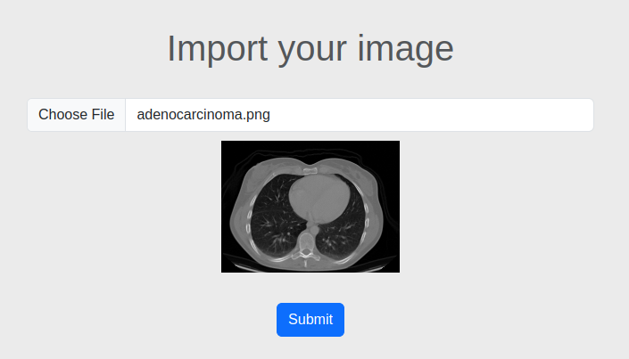
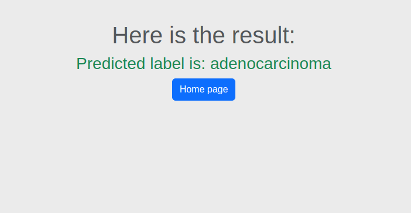

# Lung Cancer Classification
This project is a FastAPI-based API for lung cancer classification. It provides endpoints to classify chest CT images into 4 categories based on input images. In addiotion, I have dockerized the project.

# Steps
* first I have maden an effort to train the model by my own model and a pre-trained model
* I have saved the trained model resulted from the pre-trained model
* Make the API project through FastAPI and load the model 

# Classes
* Adenocarcinoma
* Large Cell Carcinoma
* Normal
* Squamous Cell Carcinoma
* Dockerize the project

## Results
  
<table>
<tr>
<td></td>
<td></td> 
</tr>
</table>


## Run The Project without docker


Install packages:
```bash
  pip install -r requirements.txt 
```
Run FastAPI:
```bash
  fastapi dev main.py
```
Open your browser and acceess project through this URL: http://127.0.0.1:8000/

Then you can submit the test image file named *adenocarcinoma.png* to see 
the result 

Also you can test the project through FastAPI docs: http://127.0.0.1:8000/docs


## Run The Project with Docker


Build the Docker image:
```bash
  docker build -t lung-cancer-app 
```
Run the Docker container:
```bash
  docker run -p 8000:8000 lung-cancer-app
```
Open your browser and acceess project through this URL: http://127.0.0.1:8000/

Then you can submit the test image file named *adenocarcinoma.png* to see 
the result 

Also you can test the project through FastAPI docs: http://127.0.0.1:8000/docs

